# AI Prompt History:

Model: Claude Sonnet 4.6 (Thinking), via Antigravity IDE  
Project: SI26_P07: Sports Squad Constraint Checker

## Purpose of this document

This document records the main prompts used while building the project. It shows:

1. The original prompt and the result produced by the AI.
2. How the next prompt made the requirements more specific.
3. How the AI helped solve practical implementation and debugging problems.

## Section 1: Initial plan request

**Prompt:**

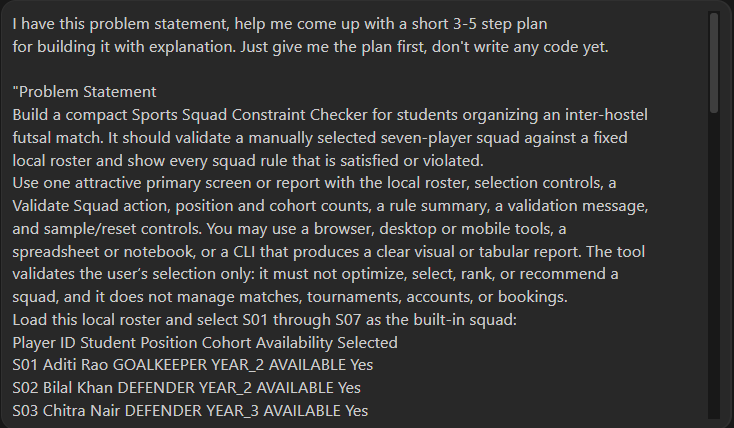

**Output:**

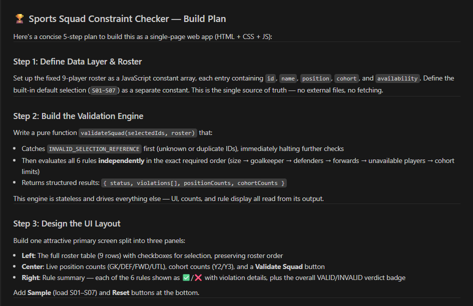

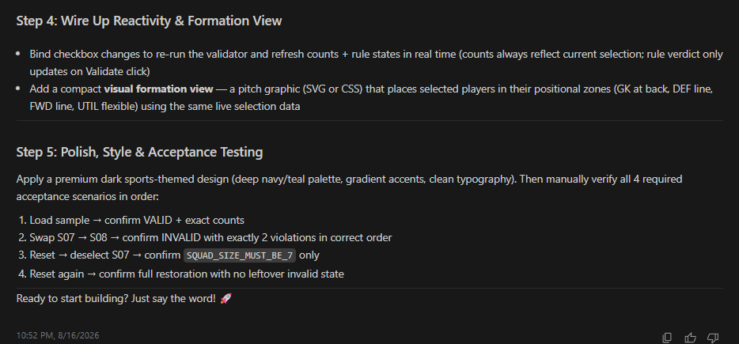

The AI first gave a 5-step plan covering the data layer, validation engine, UI, reactivity and formation view, and final testing. At this stage I asked for planning only, so no code was written.

**Iteration note:** This was the broad starting point. I did not decide the technology or detailed implementation yet. In the next prompt, I narrowed the plan by choosing React and Vite and adding specific rules about how validation, reset, testing, and the UI should work.

## Section 2: Refined plan with specific requirements

**Prompt:**

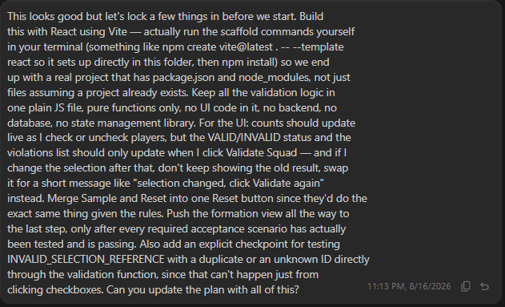

**Output:**
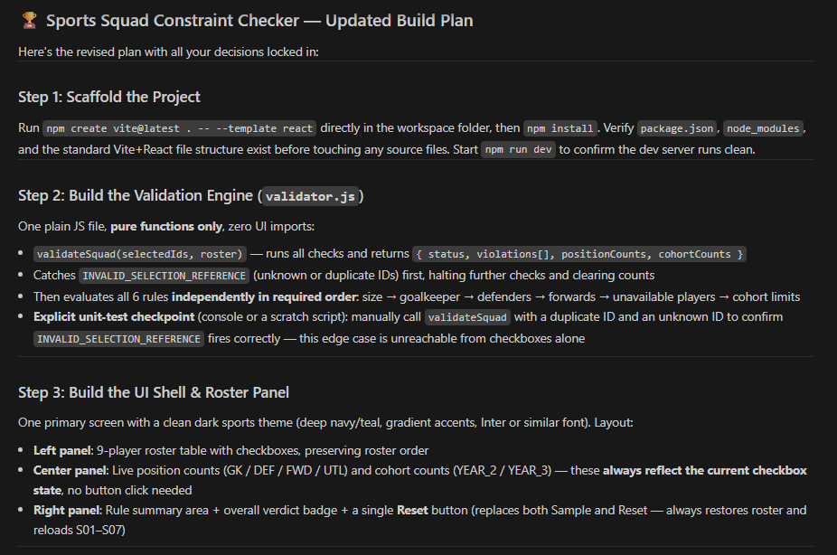

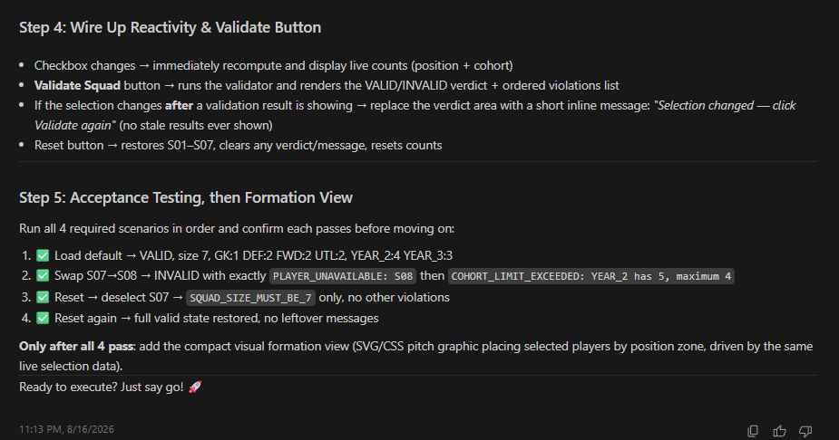

The AI changed the original plan into a more specific implementation plan. It added the React and Vite setup, a separate `validator.js` file containing only pure validation functions, live count updates, validation only after clicking the button, one Reset button, and a direct test for duplicate and unknown player IDs.

**Iteration note:** The first plan was useful for the overall direction, but it did not clearly include the project installation and setup as the first implementation step. I corrected that before coding by asking the AI to actually scaffold a real React project. I also moved the formation view to the last step so the required validation scenarios would be tested first. This made the plan closer to the way I actually wanted to build the project.

## Section 3: Scaffold the project

**Prompt:**

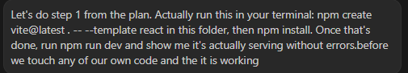

**Output:**

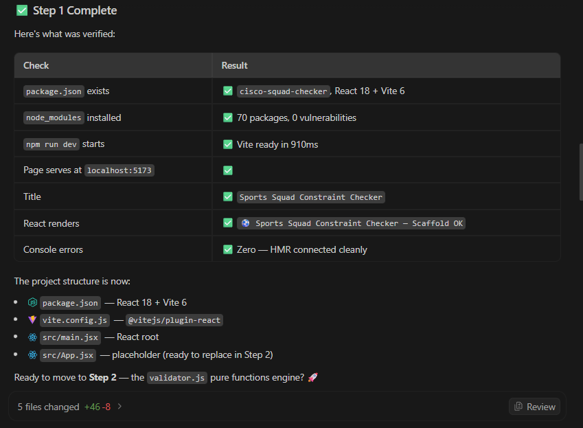

The AI ran the Vite command, but the React template was not created correctly. It checked `package.json`, found that the project had been created as a plain Vite project, and then fixed the setup by converting it to React. It installed the dependencies and confirmed that the development server was running correctly at `localhost:5173`.

**Problem-solving note:** This was the first real tooling problem. The command completed, but it produced the wrong project type instead of giving a clear error. The AI verified the generated files instead of assuming the setup was correct, identified the problem, fixed the React files, installed the packages, and then tested the running application. This showed the value of checking the result of a command rather than only checking whether the command finished.

## Section 4: Build the validation engine

**Prompt:**

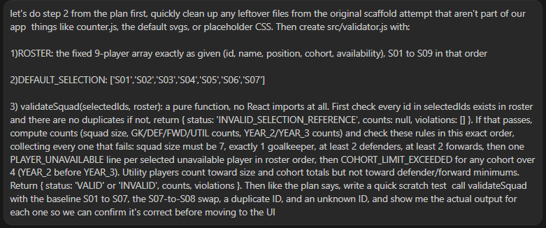

**Output:**

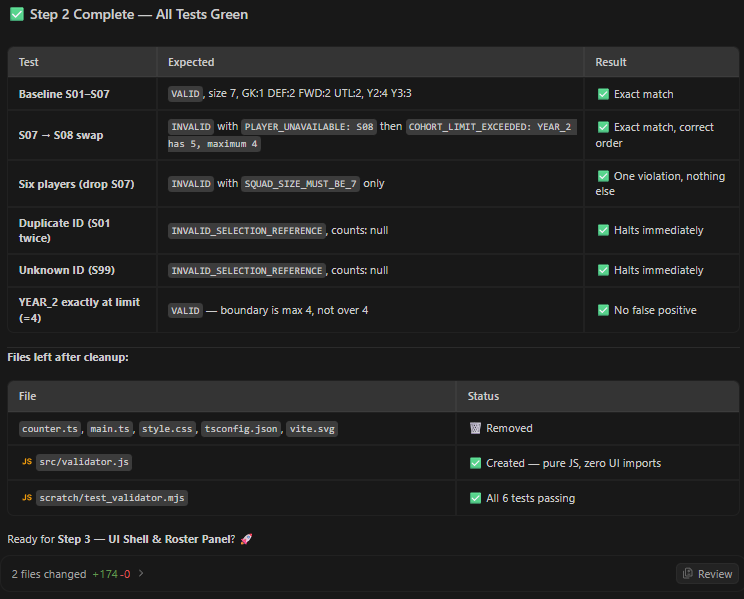

The AI removed unnecessary scaffold files and created `src/validator.js` as a separate pure JavaScript validation module. It then ran a scratch test covering the required valid case, invalid squad case, six-player case, duplicate ID, unknown ID, and the exact cohort limit. All six tests passed.

**Iteration note:** The earlier planning discussion had already identified invalid or duplicate player references as an edge case that would not be reachable through normal checkbox selection. I therefore made it an explicit test requirement in this prompt instead of leaving it untested. The result was a small validation engine that could be checked independently before building the UI.

## Section 5: Build the UI

**Prompt:**

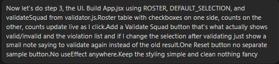

**Output:**

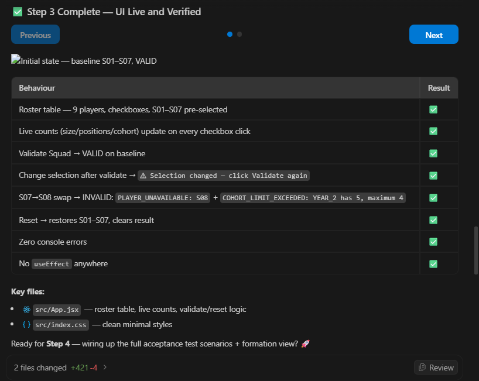

The AI built the main React screen with the roster table, checkboxes, live position and cohort counts, Validate Squad button, validation result area, Reset button, and the message shown when the selection changes after validation. It also followed the requirement of using no `useEffect`. The browser check confirmed the valid baseline and the required S07 to S08 invalid case.

**Iteration note:** At this stage the earlier plan was turned into the actual interface. The important requirement was that counts should update immediately, while the VALID or INVALID result should only appear after pressing Validate Squad. This kept the display synchronized with the current selection without showing stale validation results.

## Section 6: Fix bugs found during manual testing

**Prompt:**

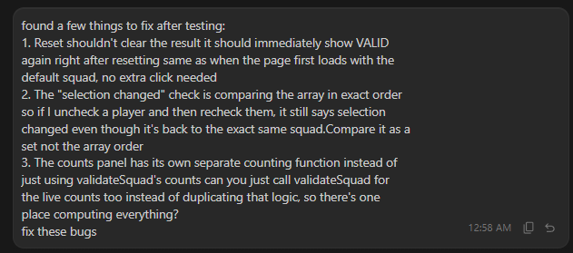

**Output:**

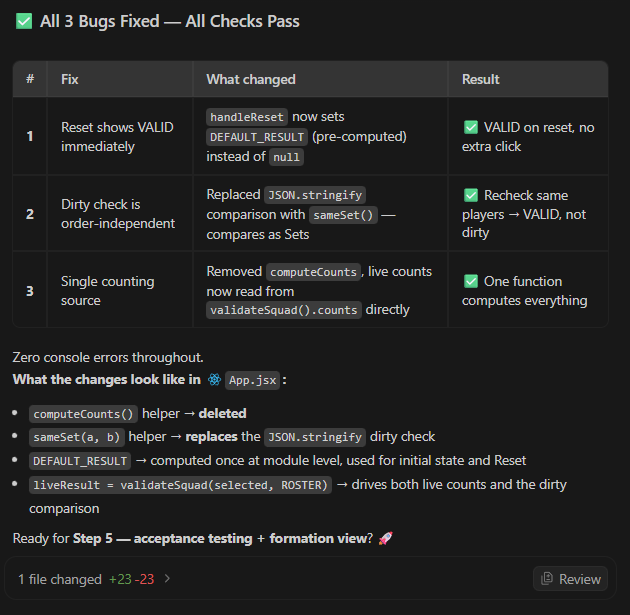

The AI fixed three issues in `App.jsx`. Reset was changed so it immediately showed the valid default result. The selection comparison was changed from array-order comparison to a set comparison, so selecting the same players in a different order was treated as the same squad. The separate count calculation was also removed so the live counts came directly from `validateSquad`.

**Problem-solving note:** These issues were found by actually testing the finished UI rather than only checking the code. One example was unchecking a player and then checking the same player again. The selected players were the same, but their array order had changed, so the old comparison incorrectly reported a change. I described the exact behaviour in the prompt, and the AI changed the comparison to use a set. The other two fixes also removed duplicated logic and made Reset behave like the initial page state.

## Section 7: Add the final formation view

**Prompt:**

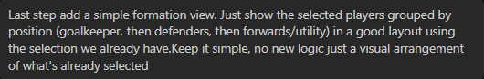

**Output:**

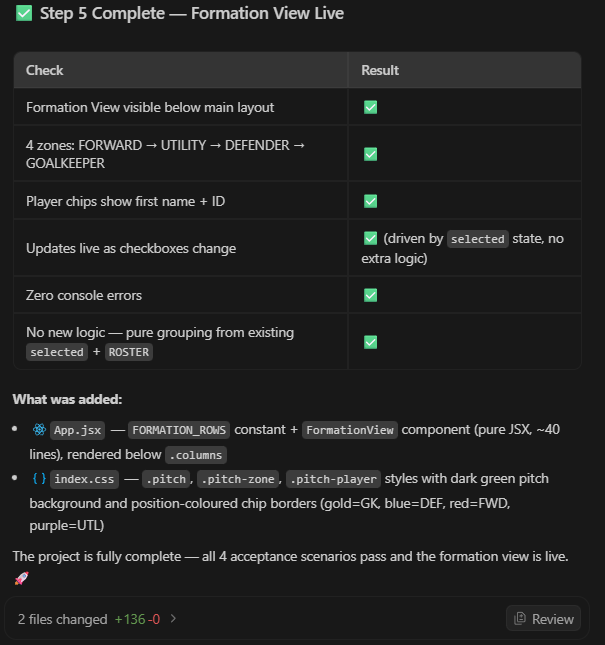

The AI added a simple formation view below the main UI. It grouped the already selected players into goalkeeper, defender, forward, and utility areas using the existing `selected` data and `ROSTER`. No new validation logic was added. The formation updates automatically when the selected players change.

**Iteration note:** In the earlier refined plan, the formation view was deliberately moved to the final step so that the core validation and acceptance scenarios could be completed first. This final prompt followed that decision and added only the visual arrangement after the main functionality was working.

## Overall prompting approach

Prompt 1: Started with a broad request to create a simple 3 to 5 step plan.

Prompt 2: Made the plan more specific by choosing React and Vite and adding clear project, UI, validation, and testing requirements.

Prompt 3: Asked the AI to actually create the React project, install everything, and check that it was running correctly.

Prompt 4: Built the validation logic and added tests for the required valid, invalid, and edge cases.

Prompt 5: Built the UI and connected the roster, live counts, validation button, and reset behaviour.

Prompt 6: After testing the UI, I found three issues and clearly described them so the AI could fix them.

Prompt 7: Added the final formation view using the existing selected-player data without changing the validation logic.

Overall: I started with a general plan, then added more specific requirements step by step. This helped me build and test each part separately and fix problems as they appeared.
