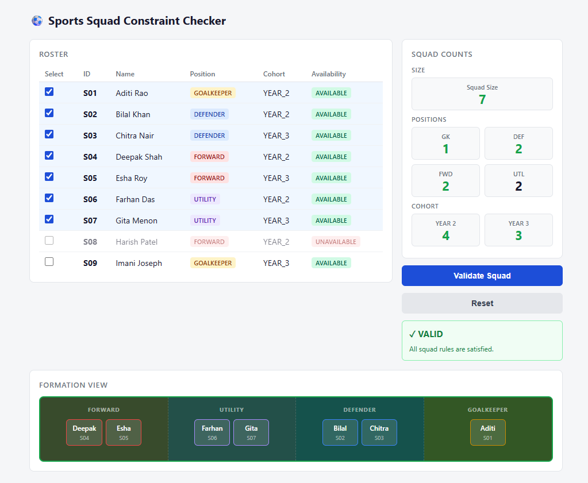

# SI26_P07 — Sports Squad Constraint Checker

A simple web tool that lets you pick 7 players from a 9-player futsal roster and checks whether your selection follows all the squad rules.

---

## What it does

- Shows a fixed roster of 9 players with checkboxes.
- You tick the players you want in your squad.
- The counts panel (squad size, positions, cohorts) updates live as you tick or untick.
- Click **Validate Squad** to see whether your selection is VALID or INVALID, with a list of every rule that is broken.
- If you change the selection after validating, the result clears and a small note tells you to click Validate again.
- Click **Reset** to go back to the default valid 7-player squad instantly.

---

## Squad rules

A squad is valid only when all of the following are true:

| Rule         | Requirement                                  |
| ------------ | -------------------------------------------- |
| Squad size   | Exactly 7 players selected                   |
| Goalkeeper   | Exactly 1 goalkeeper                         |
| Defenders    | At least 2 defenders                         |
| Forwards     | At least 2 forwards                          |
| Availability | No unavailable player selected               |
| Cohort limit | No more than 4 players from YEAR_2 or YEAR_3 |

> UTILITY players count toward squad size and cohort totals but do **not** count toward defender or forward minimums.

If more than one rule is broken, every violation is listed in the order above.

---

## How to run it

### Requirements

- [Node.js](https://nodejs.org/) version 18 or higher
- npm (comes with Node.js)

### Steps

**1. Install dependencies**

Open a terminal in the project folder and run:

```bash
npm install
```

This installs all packages listed in `package.json`. It only needs to be done once.

**2. Start the development server**

```bash
npm run dev
```

**3. Open in browser**

Go to: [http://localhost:5173](http://localhost:5173)

The page loads with the default valid squad (S01–S07) already selected and showing VALID.

---

## Run the validator tests

To check the validation logic independently without the UI:

```bash
node scratch/test_validator.mjs
```

This runs 6 test cases covering the valid baseline, the required invalid scenarios, duplicate IDs, unknown IDs, and the cohort boundary.


